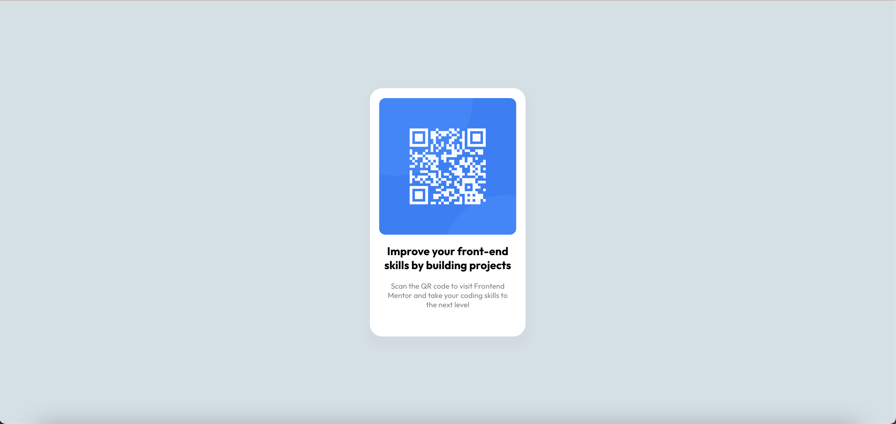

# Frontend Mentor - QR code component solution

This is a solution to the [QR code component challenge on Frontend Mentor](https://www.frontendmentor.io/challenges/qr-code-component-iux_sIO_H). Frontend Mentor challenges help you improve your coding skills by building realistic projects. 

## Table of contents

- [Overview](#overview)
  - [Screenshot](#screenshot)
  - [Links](#links)
- [My process](#my-process)
  - [Built with](#built-with)
  - [What I learned](#what-i-learned)
  - [Useful resources](#useful-resources)
- [Author](#author)

## Overview

This project focuses on building a QR component that follows mobile first development. You can clone it yourself and run it. All you need is `yarn install` and `yarn start` from root.

### Screenshot

Desktop View


Mobile View


### Links

- Solution URL: [Github][https://github.com/Sarkis-S/qr-code-component]
- Live site URL: [Netlify][https://dashing-hummingbird-695408.netlify.app/]

## My process

- I started with create react-app and merged the exercise together. I could have easily done this with vanilla HTML and CSS, but I'm a React Developer. This is actually all that is needed for this starter exercise. Nothing complicated here which is exactly what I decided to use.
- As I'm looking at the designs I'm already thinking about how I should box the individual elements together to give it structure. Once we have the structure it doesn't make much of a difference mobile or web view.
- Next I thought about semantics and how it should be applied, which is part of the structuring process.
- The fun part is giving the elements style so that it can come as close as possible to the actual design. Applying CSS is like art. You draw and erase until you have the final masterpiece. 
- Apply media queries to accommodate different screen sizes and proper meta viewport tags
- Finally, the simple import of Google fonts to use with the component

### Built with

- Semantic HTML5 markup
- CSS
- Flexbox
- Mobile-first workflow
- [React](https://reactjs.org/) - JS library

### What I learned

Overall, this a simple component that focuses more on design and CSS. By completing this component I was reminded how Cascading Style Sheets work from top to bottom with certain selectors being heavier than others.

Take this snippet from my HTML and CSS exercise file:

```
<section className='qr-items'>
  
  <div className='text-container'>
    <h1>Improve your front-end skills by building projects</h1>
    <p>Scan the QR code to visit Frontend Mentor and take your coding skills to the next level</p>
  </div>
</section>
```

```
.text-container {
  font-family: 'Outfit';
  font-size: 15px;
  color: black;
  padding-left: 15px;
  padding-right: 15px;
}

p {
  color: gray;
}
```

I was tempted to create another styling DIV for the second text after the h1, but a quick p style after the text-container is all that is needed. It works because the styling for text-container is applied, then the paragraph styling overwrites it.

Also following the flow of CSS. I was bewildered why my media query did not take effect immediately. But upon realizing my error, all I had to do was move the media query to the bottom of the page. This is necessary when building mobile-first applications because we want the styles to work for mobile first, while changes needed only take effect when sizes change to wider screens.

### Useful resources

- [Media Queries](https://developer.mozilla.org/en-US/docs/Web/CSS/Media_Queries/Using_media_queries) - This helped to give me a more in-depth understanding of media queries as needed in this exercise
- [Semantic HTML](https://developer.mozilla.org/en-US/docs/Glossary/Semantics) - MDN Docs
- [Semantic HTML](https://www.freecodecamp.org/news/semantic-html5-elements/#:~:text=Semantic%20HTML%20elements%20are%20those,content%20that%20is%20inside%20them.) - FreeCodeCamp

## Author

- Frontend Mentor - [@Sarkis-S](https://www.frontendmentor.io/profile/Sarkis-S)
